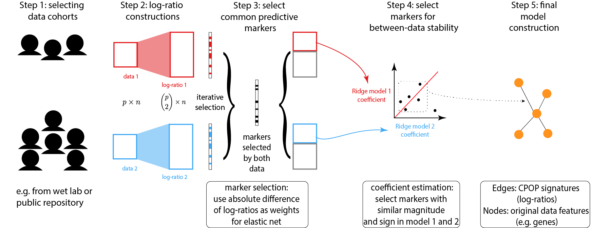

```{r}
library(CPOP)
library(tibble)
library(ggplot2)
library(dplyr)

theme_set(theme_bw(18))
```

# Introduction 

The CPOP package provides functions to perform Cross-Platform Omics Prediction method described in [our paper](https://www.biorxiv.org/content/10.1101/2020.12.09.415927v1.full). The aim is to construct a transferable risk prediction mode with a strong emphasis on addressing practical challenges in the implementation of biomarkers/assays.

Below is a schematic drawing of the CPOP procedure:



1. Identify a collection of datasets with similar clinical outcomes that can be used for joint modelling.

2. Following that, CPOP creates features that are the ratio of each gene’s expression to that of other genes.

3. Features that are predictive of the clinical outcome are then selected using a regularised regression modelling framework. These features forms a candidate set of features for further selection.

4. The candidate features in Step 3 are reduced to only those features with consistent effect sizes across multiple datasets. 

5. The final selected features serve as the markers used for final model construction. Visualisation methods are provided. 

Some of the main differences between the CPOP method and other existing methods: 

1. CPOP typically uses **two training data** in the training steps. This is because the original motivation of CPOP is to find predictive features across different platforms. As such, having two training data of difference sources helps to recreate a practical situation where the validation data is independent of the training data. 

In the past, CPOP was applied to datasets of the same disease by generated on different platforms (e.g. microarrays/RNA-Seq/targeted assays). However, this concept of finding common predictive features across multiple input data can be extended to other situations (e.g. multiple studies/batches). 

2. CPOP uses pairwise differences between columns as features. This means that we have an input data, `x` for a predictive problem, CPOP will first construct a matrix, `z`, where each column of `z` is the difference between different columns of `x`, i.e. `z1 = x1 - x2`, `z2 = x1 - x3` and so on. 

This use of features in model construction is unlike most machine learning methods out there which uses `x` directly. This is because in most omics data, the values of `x` are typically dependent on study conditions, e.g. platform/cohort/technicians. Through experimentation, we found that the columns of `z` is likely to be better preserved across these conditions. This stability is important for reproducibility and consistency in prediction values between different datasets. 

3. CPOP is not intended to be used for high dimensional data (say, number of original features greater than 1000). This is because CPOP was designed as a method for clinical validation of biomarkers going towards translation/implementation work. At these stages, much of the research discovery work has already been done and a smaller set of omics features (e.g. genes) has already been curated. CPOP was designed to work with this smaller set of candidate biomarkers in order to produce predictions of higher clinical relevance and utility. 

Users of CPOP are welcome to reduce their larger candidate set of features down to an appropriate size (typically, CPOP accepts features in the hundreds) through whichever appropriate method (e.g. features-wise univariate t-test).


# Running CPOP

## Step 1 and 2 - data selection and pre-processing

The CPOP package provides an example data, `cpop_data_binary`, to demonstrate how the various functions can be run.

`cpop_data_binary` contains a list of 7 objects:

+ `x1`, `x2`, and `x3` which are simulated gene expression data. 
+ `y1`, `y2`, and `y3` which are simulated binary response corresponding to the x's. 
+ `beta` which is the true coefficients of interest. 


After attaching these objects, we can perform the (log-)ratio constructions using the `pairwise_col_diff` on the matrices `x1`, `x2`, and `x3`. One of the main idea behind CPOP is that, the gene expression data scale (`x1`, `x2`, and `x3`) can vary greatly between data platforms. But the relative expression between the genes (e.g. difference between gene A and gene B) are more stable. `pairwise_col_diff` is a function that computes for all pairwise differences between the columns in a given matrix, with the new output being a matrix with the columns `geneA--geneB`. 

Note: the phrase "log-ratio" is used in context where the expression values of biomarkers exhibit differences across several orders of magnitudes. This is the most common in the context of gene expression data with microarray (intensity measurements) and RNA-Sequencing (counts) data. `pairwise_col_diff` assumes that these values with large magnitude of difference has been dealt with, e.g. through the use of logarithm transformations, and thus, the act of taking difference between columns of a data matrix is similar to how one would construct a ratio (i.e. log(A/B) = log(A) - log(B)). Thus, even though we refer to these values as log-ratios, the actual data matrices that we are operating on are assuming that the columns are already on a transformed scale, such that the difference between feature values is meaningful. 

```{r}
data(cpop_data_binary, package = 'CPOP')

names(cpop_data_binary)

x1 = cpop_data_binary$x1
x2 = cpop_data_binary$x2
x3 = cpop_data_binary$x3
y1 = cpop_data_binary$y1
y2 = cpop_data_binary$y2
y3 = cpop_data_binary$y3

z1 = pairwise_col_diff(x1)
z2 = pairwise_col_diff(x2)
z3 = pairwise_col_diff(x3)

boxplot(cbind(x1,x2))
```


## Step 3 and 4: feature selection

The `cpop_model` function is the main function of the CPOP package. The first four inputs are `z1`, `z2`, `y1` and `y2`, where `(z1, y1)` and `(z2, y2)` are the log-ratio matrix and the response variable of the first and second data, respectively. In this particular example, the response variable is binary, hence, we can also specify `family = "binomial"` (default) for this model. 

The `alpha` parameter is one of the penalty terms of the classic Elastic Net model, where `alpha = 1` corresponds to a Lasso model and `alpha = 0` corresponds to a Ridge model. The `cpop_model` uses `glmnet::cv.glmnet` in the backend, and so the penalty term `lambda` is automatically chosen using the default of `lambda.min`.

The CPOP model iteratively selects features based on the fit of the model or, if it reaches a pre-determined number of features with the paramter `n_features` being the main control for this. Here, we arbitary set this to a small number of 10 for illustration. 

```{r}
cpop_result = cpop_model(z1 = z1, z2 = z2, 
                         y1 = y1, y2 = y2, 
                         family = "binomial",
                         alpha = 1, 
                         n_features = 10)
```


## Step 5: visualisation

The output of the `cpop_model` function is a `cpop` object with its own defined methods. 

The main method for a `cpop` object is the `plot_cpop` function, which produces several useful plot to understand what the CPOP methodology has done or performed. 

```{r}
class(cpop_result)
```

The first plot is using the `type = "text"` option. A labelled scatter plot shows the estimated coefficients of the selected features from data1 (i.e. `(z1, y1)`, x-axis) vs the same coefficients from data2 (i.e. `(z2, y2)`, y-axis).

```{r}
plot_cpop(cpop_result = cpop_result, type = "text")
```

We can see that most of the selected features had similar coefficients across the two data. This is exactly what CPOP is aiming to achieve: selecting features that are consistent within each datasets. 

However, each of the feature (e.g. `X01--X10`) actually corresponds to two of the original features in the raw data `X01` and `X10` in the data `x1` and `x2`. We can further visualise these features in the original features. 

```{r}
plot_cpop(cpop_result = cpop_result, type = "ggraph")
```

Here we see that despite the features that we have selected in terms of the ratio, in actual fact, only a handful of features are useful. In particular, `X01`, `X09` and `X17` are the main contributors. 

## Predictions 

Another useful method on the `cpop` object is the `predict_cpop` function. This function takes the previous CPOP result and a new (log-)ratio matrix to produce predictions. 

The first column of the output are the sample IDs. The second and third column are prediction results from data1 and data2 respectively. Since we have done the previous diagnostic test that the coefficient size between the two data are very similar, we do expect that these values to be very highly correlated. The last column is `cpop_model_avg`, which is a simple average between the two predicted values. 

Note that the predicted values here are on the logit scale (recall that we are performing a logistic regression on binary responses using the elastic net model in the background). We can also transform these values back to predicted probability scale using the `CPOP::expit` function. 

```{r}
predict_cpop(cpop_result, newz = z3) %>% head()

predicted_plotdf = predict_cpop(cpop_result, newz = z3) %>%
  dplyr::mutate(
    cpop_model1 = expit(cpop_model1), 
    cpop_model2 = expit(cpop_model2), 
    cpop_model_avg = expit(cpop_model_avg))

predicted_plotdf %>% 
  ggplot(aes(x = cpop_model1, y = cpop_model2)) +
  geom_point() +
  geom_abline()
```

<!-- # Naive Lasso -->

<!-- ```{r} -->
<!-- lasso_result = naive_glmnet(z1, z2, y1, y2, alpha = 1, intercept = FALSE) -->
<!-- lasso_result -->
<!-- ``` -->

<!-- # Plotting -->
<!-- ```{r} -->
<!-- plot_cpop(cpop_result) -->
<!-- plot_cpop(lasso_result) -->

<!-- plot_cpop(cpop_result, type = "ggraph") -->
<!-- plot_cpop(lasso_result, type = "ggraph") -->
<!-- beta -->
<!-- ``` -->

<!-- # Prediction  -->
<!-- ```{r} -->
<!-- # z3 = pairwise_col_diff(x3) -->
<!-- # boxplot(y3 ~ predict_cpop(cpop_result, newz = z3)$cpop_model_avg) -->
<!-- # x3 = matrix(rnorm(n * p, mean = 3, sd = 1), nrow = n, ncol = p) -->
<!-- # colnames(x3) = colnames(x1) -->
<!-- # z3 = pairwise_col_diff(x3) -->

<!-- predict_cpop(cpop_result, newz = z3) %>%  -->
<!--   ggplot(aes(x = cpop_model1, y = cpop_model2)) + -->
<!--   geom_point() + -->
<!--   geom_abline()  -->

<!-- predict_cpop(cpop_result, newz = z3)[,2:3] %>% cor -->

<!-- lasso_pred1 = tibble( -->
<!--   lasso_pred1 = predict(lasso_result$glmnet1, newx = z3), -->
<!--   lasso_pred2 = predict(lasso_result$glmnet2, newx = z3)) -->

<!-- lasso_pred1 %>% cor -->

<!-- lasso_pred1 %>%  -->
<!--   ggplot(aes(x = lasso_pred1, y = lasso_pred2)) + -->
<!--   geom_point() + -->
<!--   geom_abline() -->
<!-- ``` -->

<!-- ```{r} -->
<!-- sessionInfo() -->
<!-- ``` -->

